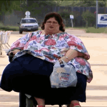

# FATTY ACIDS

**Scope**
- Floors: **m = 4** (1..4)
- Elevators: **n = 1..3**
- Must pass with **0% packet loss** (normal) and remain functional with **up to 30% packet loss** (degraded).
- The Norwegian spec below is treated as **single-elevator (local)** behavior.
- The English spec is treated as **multi-elevator (distributed)** behavior.

**Notation**
- Hall calls: `HallFUp`, `HallFDown` (F ∈ {1..4}, only valid directions at edges)
- Cab calls: `CabF` (local to a single elevator workspace)
- “Door open” is indicated by **door lamp ON**
- “Obstruction” is indicated by **obstruction switch ON**
- “Stop” is indicated by **stop button pressed**
- “Defined state” = controller knows current floor (floor indicator correct; not “between floors unknown”)

**Packet loss setup (example)**
- Run the system with `packetloss.sh` / `packetloss.d` set to:
  - **0%** (baseline), then **10%**, **20%**, **30%**
- For any test marked “(PL)”, run it at **each** loss level: 0/10/20/30.

---

# 0. Global acceptance criteria (applies to all tests)

- **Button lights are service guarantees**
  - If a hall button lamp turns ON, some elevator must arrive and service it.
  - If a cab button lamp turns ON, **that same elevator** must service it.
- **No calls are lost**
  - Calls survive: temporary network disconnect, packet loss, elevator crash/restart, motor power loss (as applicable in your setup), door obstruction.
  - Recovery time to re-distribute / re-sync: **seconds**, not minutes.
- **Door correctness**
  - Door lamp never ON while moving.
  - Door open duration **3 seconds**, extended while obstruction is active.
- **Sensible behavior**
  - No “stop at every floor just in case”.
  - Hall calls are direction-specific (arriving “up” does not clear “down” unless explicitly switching direction with the specified 3s “announce” behavior).

---

# 1. FAT — 1 elevator (single-elevator behavior)

## 1.1 Startup / initialization

| Elevator | Initial condition | Action | Expected |
|---|---|---|---|
| 1 | Powered on at a **known floor** (e.g. floor 2) | Start program | Immediately enters **defined state**; floor lamp shows 2; does not move unnecessarily |
| 1 | Powered on **between floors** (undefined position) | Start program | Performs initialization travel until a floor sensor is reached; only then becomes **defined** |
| 1 | Undefined position | Press any `Hall*` / `Cab*` during init | **Ignored** until defined state is reached (no order lights latched / no motion caused by these presses) |
> last one fails on purpose
## 1.2 Handling of orders (basic)

| Elevator | Initial condition | Action | Expected |
|---|---|---|---|
| 1 | Floor 1, idle | Press `Hall3Up` | Hall3Up lamp turns ON quickly; elevator moves to 3; stops; door lamp ON **3s**; Hall3Up lamp turns OFF |
| 1 | Floor 4, idle | Press `Hall2Down`, `Hall3Down` | Lamps turn ON quickly; elevator goes to 3 first, stop+door 3s, clears Hall3Down; then goes to 2, stop+door 3s, clears Hall2Down |
| 1 | Floor 4, idle | Press `Cab2`, `Cab3` | Cab lamps turn ON quickly; elevator goes to 3, stop+door 3s, clears Cab3; then goes to 2, stop+door 3s, clears Cab2 |
| 1 | Idle (any floor) | Press many buttons rapidly (all valid halls + all cabs) | System never deadlocks; all lit orders eventually served (H1/H4/H5) |
| 1 | Floor 1, idle | Press **all valid hall calls** + **all cab calls**x| (rapidly) | Elevator performs a **sensible sweep**: serves all upward-reachable requests while moving up, reaches floor 4, then serves remaining downward-direction requests on the way down. No deadlock, no oscillation, no unnecessary stops. All orders are eventually cleared. |
| 1 | Floor 3, idle | Press `Hall2Up` | Elevator moves **down** to floor 2, stops, opens door, clears `Hall2Up`. |
| 1 | Floor 2, idle | Press `Hall3Down` | Elevator moves **up** to floor 3, stops, opens door, clears `Hall3Down`. |

## 1.3 Direction rule (don’t serve opposite-direction hall calls)

| Elevator | Initial condition | Action | Expected |
|---|---|---|---|
| 1 | Floor 4, moving **down** to floor 1 due to `Cab1` | While passing floor 2, press `Hall2Up` | Elevator continues to 1 first (does **not** stop for Hall2Up while moving down); later serves Hall2Up on the way up (H2 / FAT H3) |

## 1.4 Order clearing at stop (all orders in floor are cleared appropriately)

> For **single-elevator FAT**, verify clearing behavior matches your implemented policy and the test rig’s expectations.

| Elevator | Initial condition | Action | Expected |
|---|---|---|---|
| 1 | Floor 2 idle | Press `Cab2` (already at floor 2) | Door lamp ON immediately for 3s; Cab2 lamp turns OFF; elevator stays still |
| 1 | Approaching floor 3 with `Cab3` active | Also press `Hall3Up` before arrival | On stop at floor 3: clears Cab3; and clears hall call(s) according to your “served at stop” policy; door 3s; no extra stop at 3 afterwards |
| 1 | Idle at floor F | Repeatedly press `CabF` while door is open | Door remains open as long as presses continue; door closes **3 seconds after the last press**. No motion occurs. |
| 1 | Idle at floor F | Repeatedly press valid `HallFUp` / `HallFDown` | Door remains open as long as presses continue; door closes **3 seconds after the last press**. Corresponding hall lamp clears once served. |

## 1.5 Lights (floor indicator + order lamps)

| Elevator | Initial condition | Action | Expected |
|---|---|---|---|
| 1 | Between floor 2 and 3 moving up | Observe floor indicator | Indicator shows **last passed floor** (floor 2) while between floors (L4), and only one floor lamp lit (L5) |
| 1 | Any | Press any order button | Corresponding button lamp turns ON quickly (L1), stays ON until served (L1/L2), then turns OFF when served (L4 FAT) |

## 1.6 Door + obstruction behavior

| Elevator | Initial condition | Action | Expected |
|---|---|---|---|
| 1 | Arrive at ordered floor | Observe | Door lamp ON exactly **3 seconds**, then OFF; elevator does not move during door open (S1/D1/D2/D3) |
| 1 | Door lamp ON (open) | Toggle obstruction ON and keep ON > 3s | Door remains open as long as obstructed (D4/R1) |
| 1 | Obstruction ON, door open | Toggle obstruction OFF | Door remains open for **3 more seconds**, then closes |
| 1 | Door lamp OFF (closed) | Toggle obstruction ON | No effect (R1) |
| 1 | Door lamp ON, CabF lamp OFF | Press `CabF` | Door remains open (timer resets); no duplicate order is created; cab lamp behavior remains consistent. |
| 1 | Door lamp ON, HallF* lamp OFF | Press valid `HallF*` | Door remains open (timer resets); hall lamp clears immediately when served; no extra stop later. |

# 2. FAT — 2 elevators (distributed behavior)

## 2.1 Normal mode: shared hall lights, local cab lights (0% loss)

| Elevator | Initial condition | Action | Expected |
|---|---|---|---|
| 1 | Floor 1 idle, connected | Press `Cab4` on E1 panel | Only E1 Cab4 lamp ON; E1 goes to 4 and serves; E2 does not act |
| 2 | Floor 4 idle, connected | Press `Cab1` on E2 panel | Only E2 Cab1 lamp ON; E2 goes to 1 and serves; E1 does not act |
| 1 & 2 | E1 at floor 1 idle, E2 at floor 4 idle | Press `Hall2Up` on **workspace of E1** | `Hall2Up` lamp becomes ON on **both** workspaces; exactly **one** elevator is assigned and arrives; lamp turns OFF on both when served |
| 1 & 2 | Same as above | Press `Hall3Down` on **workspace of E2** | Same: lamp mirrored; one elevator serves; clears everywhere on service |

## 2.2 Distribution sanity (efficiency baseline)

| Elevator | Initial condition | Action | Expected |
|---|---|---|---|
| 1 & 2 | E1 at floor 1, E2 at floor 4 | Press `Hall4Down` | Prefer E2 serves quickly (already at 4); E1 should not race there “just in case” |
| 1 & 2 | E1 at floor 2 going up, E2 idle at floor 1 | Press `Hall2Down` | E1 should not stop (moving opposite if it’s committed up); E2 should be assigned if it can serve sooner |

## 2.3 “No calls lost” under elevator crash/restart (cab calls must persist locally)

| Elevator | Initial condition | Action | Expected |
|---|---|---|---|
| 1 & 2 | Both connected, idle | On E1: press `Cab4` (lamp ON), then **kill/restart E1 software** | After restart, E1 recovers its Cab4 request (lamp ON again if your HW supports), and eventually serves it (cab calls not lost) |
| 1 & 2 | Both connected, idle | On E2: press `Cab3` (lamp ON), then **kill/restart E2 software** | After restart, E2 recovers its Cab3 request (lamp ON again if your HW supports), and eventually serves it (cab calls not lost) |
| 1 & 2 | Both connected, idle | Press `Hall3Up`, then **kill/restart E2 software** | Hall3Up remains guaranteed: some elevator (likely E1) serves it; once E2 returns it re-joins and syncs hall state |
| 1 & 2 | E1 servicing a hall request | While E1 is moving, **cut motor power** so it stops between floors | E2 detects E1 failure within seconds and takes over servicing **all remaining hall calls**. No hall call is lost. |

## 2.4 Network disconnect handling (disconnected elevator still serves its lit calls)

| Elevator | Initial condition | Action | Expected |
|---|---|---|---|
| 1 & 2 | Both connected; create multiple lit orders on E1 (cab + any halls already lit) | Disconnect E1 from network (pull cable / disable iface) | E1 continues serving **currently lit** calls locally; continues accepting **new cab calls**; does not require manual restart after reconnect |
| 1 & 2 | E1 disconnected, E2 connected | While disconnected, press `Hall2Up` on E1 workspace | Unspecified by requirements: acceptable outcomes: (A) refused (lamp might not turn on), or (B) queued locally. **But** at least one workspace (E2) must still be able to place hall calls successfully |

---

# 3. FAT — 3 elevators (distributed behavior)

## 3.1 Shared hall lights, local cab lights (0% loss)

| Elevator | Initial condition | Action | Expected |
|---|---|---|---|
| 1,2,3 | E1 floor 1 idle, E2 floor 2 idle, E3 floor 4 idle | Press `Hall3Up` on any workspace | Hall3Up lamp mirrors to all workspaces; exactly one elevator serves; lamp clears on all when served |
| 1,2,3 | Same | Press `Cab1` on E3 panel | Only E3 Cab1 lamp ON; only E3 serves it |

## 3.2 Multi-order distribution & “not silly”

| Elevator | Initial condition | Action | Expected |
|---|---|---|---|
| 1,2,3 | E1 at 1, E2 at 2, E3 at 4 | Press `Hall4Down`, `Hall1Up`, `Hall2Up` quickly | Orders distributed so service is prompt; elevators should not all stop at all floors; each hall light is served by some elevator and then clears everywhere |

## 3.3 Failure tolerance with assumption “at least one elevator healthy”

| Elevator | Initial condition | Action | Expected |
|---|---|---|---|
| 1,2,3 | All connected, idle | Create hall calls on multiple floors; then crash E1 and disconnect E2 | Remaining elevator (E3) still serves all lit hall calls; system remains usable; no call lost |
| 1,2,3 | All connected, idle | On E2: press `Cab3` (lamp ON), then **kill/restart E2 software** | After restart, E2 recovers its Cab3 request (lamp ON again if your HW supports), and eventually serves it (cab calls not lost) **REDO ON THE TWO OTHER ELEVATORS**|
| 1,2,3 | E1 servicing hall call, E2 idle, E3 idle | Disable E1 motor so it is stuck between floors | E2 or E3 takes over remaining hall calls. E1 does not block global progress. System remains usable. |

---

# 4. Packet loss robustness tests (must work up to 30% packet loss)

> Run all tests in this section at packet loss: **0%, 10%, 20%, 30%**.

## 4.1 Hall light convergence under loss (PL)

| Elevators | Initial condition | Action | Expected |
|---|---|---|---|
| 2 or 3 | All connected | Press `Hall2Up` once | The lamp should turn ON on **at least one** workspace quickly. Under normal conditions (0% loss), it should match on all. Under loss, eventual convergence is acceptable, but **service guarantee** holds once any lamp is ON |
| 2 or 3 | All connected | Press many hall calls rapidly (`Hall1Up`, `Hall2Up`, `Hall3Down`, `Hall4Down`) | No deadlock; each lit hall lamp is eventually served and clears (even if some workspaces temporarily disagree due to loss) |

## 4.2 Cab calls unaffected by loss (PL)

| Elevators | Initial condition | Action | Expected |
|---|---|---|---|
| 2 or 3 | All connected | On E2, press `Cab4`, `Cab1` rapidly | Cab lamps are local and immediate; E2 serves regardless of packet loss; no other elevator executes E2’s cab calls |

## 4.3 “No lost calls” with loss + intermittent reconnect (PL)

| Elevators | Initial condition | Action | Expected |
|---|---|---|---|
| 2 or 3 | All connected | With 30% loss, press `Hall3Up`, then disconnect/reconnect one elevator’s network | Orders still served; after reconnect, hall lamp state re-synchronizes within **seconds**; system continues without manual restart |

---

# 5. Direction-specific hall clearing & “announce direction change” (distributed spec)
> fails both of these tests
## 5.1 Passing through (no direction change)

| Elevators | Initial condition | Action | Expected |
|---|---|---|---|
| 1, 2, 3 | E1 at floor 1. E2 and E3 at floor 4. No hall or cab calls are active. | 1. Inside E1, press `Cab3` (or any floor above 2). Confirm that E1 starts moving upward toward floor 3. 2. While E1 is between floors 1 and 2, press `Hall2Up` and `Hall2Down`. | **At the moment E1 arrives at floor 2:** • E1 stops at floor 2 and opens its door. • Door remains open for the normal door-open duration only (no extra delay). • `Hall2Up` light turns **OFF** on all workspaces at the time the door opens. • `Hall2Down` light remains **ON** on all workspaces while the door is open. • Door closes after the normal door-open duration. • E1 continues moving upward toward floor 3 after leaving floor 2.  **After E1 departs:** • `Hall2Down` remains active and visible in the system state. • `Hall2Down` is cleared only when an elevator later arrives at floor 2 while moving downward. |

---

## 5.2 Turn around (direction change with extra 3s)

| Elevators | Initial condition | Action | Expected |
|---|---|---|---|
| 1, 2, 3 | E1 at floor 1. E2 and E3 at floor 4. No hall or cab calls are active. | 1. Inside E1, press `Cab2`. 2. While E1 is between floors 1 and 2, press `Hall2Up` and `Hall2Down`. 3. While E1 is stopped at floor 2 with its door open, press `Hall1Down` (or any hall-down request below floor 2). | **At the moment E1 arrives at floor 2:** • E1 stops at floor 2 and opens its door. • `Hall2Up` light turns **OFF** on all workspaces when the door opens. • `Hall2Down` light remains **ON** on all workspaces.  **During the stop at floor 2:** • Door remains open for the normal door-open duration **plus an additional 3 seconds** (continuous open, no close/reopen).  **After the extra 3 seconds:** • Door closes. • E1 departs **downward** toward floor 1.  **After E1 departs:** • `Hall1Up` remains active and visible in the system state. • `Hall2Down` is cleared only when an elevator later arrives at floor 2 while moving downward.  • Note, an elevator on 4th floor might go down, but thats not a bug, hall assigner wants that|

---

tests to add 
- obstruction on, then press hall, door should stay on
- obstruction on, then press cab, door should stay on
- 2.2.2 vague af. should be between floor x and y isntead of on floor 2 going up.
- 
bugs:
- performing 5.2 but pressing cab3 instead of cab2, The light on cab3 on E1 remains on indefinitely
- pressing hall or cab after obstruction is on, the door closes after 3 sec, it should be on